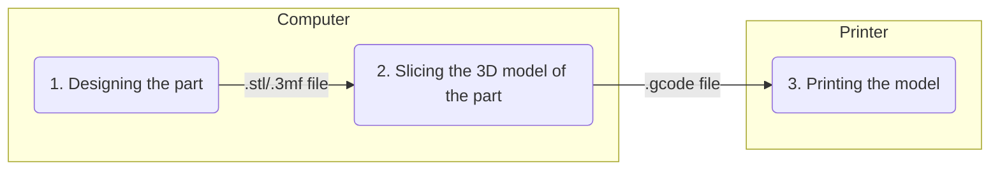

## Introduction

For most people getting started with 3D printing, it usually seems like a black box; you give it a 3D model of something you want, and it spits out a real, tangible object. Don't get me wrong, there's nothing inherently wrong with viewing 3D printing this way. However, that's like buying a racing bike just to use it in 1st gear all the time; gaining a little more understanding about how the machine (or bicycle, if we are to continue the analogy) works goes a long way for getting what you want done faster and better.

This bundle is designed in modules: each module assumes the reader has read through and understood the previous bundle, and they explain different stages of the 3D printing process. They are ordered such that earlier modules contain fundamental knowledge about 3D printing, while later modules contain more obscure bits of information which you may be interested in if your goal is to get the absolute most out of your 3D printer. 

This is not a course; you are free to stop at any module if you deem that any further information will only lead to diminishing returns.

**This bundle will be focusing on FDM/FFF (Fused Deposition Modelling/Fused Filament Fabrication) 3D printing. In layman terms, the type of 3D printing where plastic filament is involved.**

## What is the 3D printing process?

It is the process to get from an idea of a component to a printed 3D model.

In this bundle, the 3D printing process I will be referring to is the following:

## Module Structure

The modules will be arranged in the following topical order:
- Module 1 - 