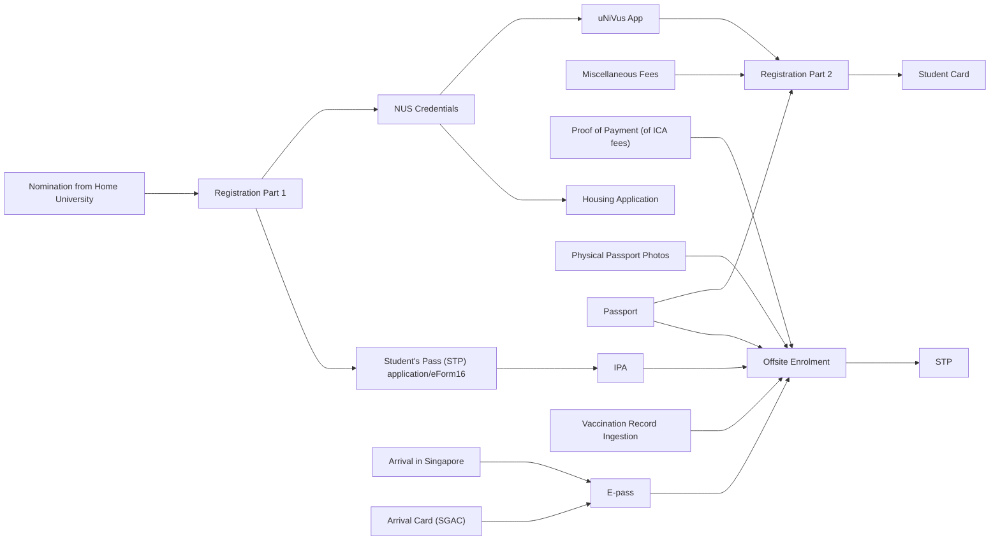

+++
title = "[1] Pre-departure"
date = 2024-01-18T08:39:00+08:00
draft = false
mermaid = true
+++

# Applying

In January 2023, I applied to go on an exchange semester at the National University of Singapore (NUS) for spring of 2024. It was a all-in decision, as in that if I didn't get the opportunity, I wouldn't go on exchange at all. Luckily, my application was successful and I was nominated to go on the exchange by my home university, despite NUS being the [second most applied to exchange destination at Aalto](https://www.aalto.fi/sites/g/files/flghsv161/files/2023-03/Application%20preferences_Nov22%2C%20Jan23_ed.pdf).

Fast forward a bit, and I was contacted by NUS to begin my application on their end. This involved filling in forms for both NUS and the Immigration & Checkpoints Authority (ICA) of Singapore. Here's my attempt at depicting all the steps in a dependency graph:

(Disclaimer: I did the process roughly a month ago, but as it was quite the multi-step process, I may have forgotten or misremembered some details. The list below generally depicts my experience with the process, but the exact application guide can be found [here](https://sway.cloud.microsoft/lnleYFhAzwkvtX9Z).)

The steps I completed before my flight were as follows:
1. [NUS] Registration Part 1
	1. This gave me access to an NUS account for me to use their systems.
	2. For their course selection, I chose 8 courses (the maximum allowed to select), of which I got 3. Among the 3, two of them had a conflicting schedule, causing me to end up with only 2 courses.
2. [ICA] Applying for Students Pass (STP), aka student visa.
3. [NUS] Housing application (for on-campus accommodation)
	1. I was given 3 choice slots which I had to fill in order of my preference. I actually ended up missing the first round of applications, which meant that I ended up applying during the second round. I chose UTR (AC), UTR (Non-AC), and PGPR (Non-AC), in that order. (AC = Air Conditioning)
4. [NUS] Miscellaneous fee payment
	1. This was a roughly 150 SGD fee which had to be paid.

Some of the steps (such as the STP application) required intermediary approval steps, but I was very surprised at how quickly those were completed. For example, after submitting my student ID photo, it was approved within 24 hours. Additionally, every time I had questions and emailed either ICA or NUS to ask, I usually got a reply within 1 business day.

Upon having my STP application approved, I was given a document called an "In-Principle Approval." This served as a kind of temporary student visa, which can also be used to enter Singapore in place of a visa if your passport requires a visa to enter.

Next, my housing application came back with some results. It turned out that I got none of my selected accommodations. However, as part of the application, I ticked a box stating that they could assign me to whatever free rooms they had if my choices were rejected. This landed me a non-AC room in Pioneer House (PH). To accept the offer, I had to pay all weeks' worth of rent up front, along with an application fee. Additionally, it turned out that the regular check-in day was the 14th of January, when I was landing on the 12th of January. This meant that I had to apply for early check-in, costing me an additional fee of about 58 SGD.

# Extras

I also decided to get a SIM card from Singtel. They offered an option to order the SIM card online and pick it up at the airport, which is what I had planned to do. I went with their 30 SGD tourist SIM, as I wanted a reliable connection when I was settling into Singapore. This actually only cost me about 12 euros, as buying online seemed to have some discount attached to it.