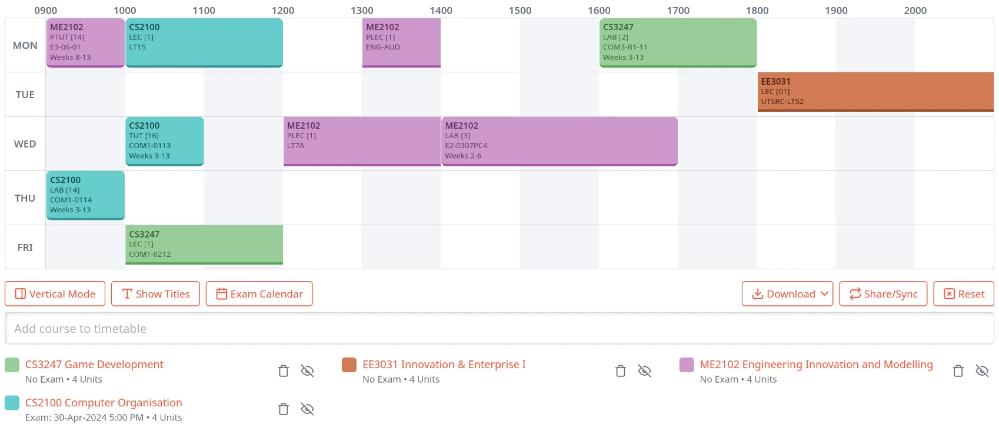

+++
title = "[3] Academic Matters"
date = 2024-01-21T14:36:30+08:00
draft = false
+++

# Course Selection

At Aalto, our course selection process simply involves checking Sisu (our course management system) and registering for courses during their registration period. They rarely check for prerequisites, and it's almost guaranteed to get any course you need. Registering for exercise sessions is done alongside the course registration; you simply select which exercise group you wish to be in as part of the course registration process. It sounds a little complicated, but in reality, it involves ticking a few checkboxes before hitting the "register" button.

At NUS, the process isn't so straightforward. For each semester, there is a course "Add/Drop Period," which is a roughly 36 hour period where one can modify their existing courses for the semester. We have to request for courses and upload our course transcript, and prerequisites are checked. We can select up to 6 courses, and we have to rank them by preference. Furthermore, every course has very limited availability, meaning it's quite likely you don't get your choices. 

Upon getting your selection results, you then need to request for tutorials and lab sessions. Tutorials are essentially our exercise sessions; it's a session for applying the knowledge taught in the lectures to problems. Usually, this involves guidance. Labs, on the other hand, seem to involve just a reservation for a room with minimal guidance (if any). I have yet to go to a lab, so I'm not too sure about this.

## My Selection

I purposely didn't state the courses I applied for since I kept getting rejected from them (I applied for 12 courses in total for both rounds, but got a final total of 4). My courses are:
- CS2100 - Computer Organization
	- I picked this mainly for the assembly content as there are a few weeks with quite a lot of hands-on work with MIPS assembly. Besides that, this course overlaps quite heavily with ELEC-A7100 (Basic Course in C Programming) and ELEC-E8001 (Embedded Real-Time Systems).
- CS3247 - Game Development
	- I picked this for two reasons:
		- I wanted to get into game development at some point just because it sounds fun.
		- I wanted a course that involved programming in a team. I wanted to see how it was like to work alongside Singaporean students.
- EE3031 - Innovation & Enterprise I
	- I picked this because I needed a course from the College of Design and Engineering that didn't have conflicting timeslots with my other courses.
- ME2102 - Engineering Innovation & Modelling
	- I picked this because I wanted to properly learn CAD modelling. My existing experience involves just sketching, extruding, exporting, and 3D printing, but this course properly teaches CAD from the perspective of a mechanical engineer. I've wanted to learn how to design physical machines within software, and this seemed like the perfect opportunity to learn.

My schedule looks like this:

This schedule was created with a student-created website called [NUSmods](https://nusmods.com), which looks way better than EduRec, which is what NUS has for course management.

Yes, I also planned for as few exams as possible to lighten the workload towards the end of the semester. I also tried to cluster as many sessions as possible together to maximize the amount of time blocks I have for concentrated work in one of my accommodation's seminar/reading rooms.
