+++
title = "[5] Final Report - End of Exchange"
date = 2024-07-09T22:53:14+03:00
draft = false
+++

This is going to be a really long, detailed report about my exchange semester at NUS. Some parts are just about administrative processes and paperwork, which may be boring, so feel free to skip and read as needed. 

I'm simply going into a lot of detail as I myself wished I had known everything about what to expect before my exchange. Also, get ready to remember a whole lot of abbreviations.

Don't expect many pictures, though. I mainly took pictures of food... T-T
# Background

Hi! I'm a 3rd-year bachelor student at Aalto University, taking the Digital Systems and Design major. Formally, my degree is

> Aalto Bachelor in Science and Technology and M.Sc. (Tech.) - Digital Systems and Design

Between the 10th of January to the 13th of May (Semester 2/Terms IV-V) in 2024, I was on exchange at the National University of Singapore (NUS).

**Disclaimer:** Before I talk about my experience, I would like to note that I'm originally from Malaysia (has similarities in culture/life), which means I may completely miss some things that other exchangers may find weird/interesting as I'm used to them. (For example, Singlish is something I'm fairly used to hearing/using)

# Pre-Exchange

## Applying, Part 1: Aalto's side

To apply for an exchange semester at NUS, I had to first pick out the courses I wanted to take. I used [NUSMods](https://nusmods.com/) to help me find courses, and I selected 6. The requirements that were set were:
- At least 70% of the courses must be from the College of Design and Engineering (which included electrical engineering courses, mechanical engineering courses, etc).
- The courses needed to be in a list of courses available to exchange (aka non-graduating) students.
- I cannot select a course whose content largely overlaps with a course I have already completed at Aalto.
- The first digit of the numerical part of the course code should be between 1-4 (denotes bachelor-level courses). That is, I could apply to attend CS1010 or CS2100, but not CS5218.

Luckily, most of the courses available were courses I was allowed to take, so my process involved first finding the course I want on NUSMods, then using Ctrl + F in the list to figure out if I'm allowed to take it.

Additionally, it seemed like almost all courses at NUS courses have the following types of sessions:
- In-person lecture, which may or may not have attendance taken. Almost all courses have lectures.
- Tutorials, which involve walking through the solutions for exercises. Tutorial sessions are usually not graded, but attendance may be taken. Only some courses have tutorials.
- Labs, which involve doing exercises with minimal assistance. Lab sessions are graded, and attendance will usually be taken. Only some courses have labs.

Tutorials and labs are somewhat like what we in Finland consider "exercise sessions."

Anyway, I used NUSMods to verify that the courses I picked had minimal overlapping sessions as well.

A small interesting fact: some courses at NUS have lectures that end at 9 PM, which was pretty crazy to me.

After submitting my application, I successfully got "nominated" (which basically means I've been approved on Aalto's end) despite the difficult odds for NUS applications (44 applications, 8 + 8 accepted).

**Fun fact:** NUSMods was actually a student-started project! And thank goodness for it, as all other means of figuring out course schedules are a nightmare to work through.

## Applying, Part 2: NUS's side

During late August, I received an email from my exchange coordinator about the next steps. I had almost the whole of September to submit an exchange application on NUS's side via a web portal, which included my personal details as well my course selection. However, this time round, I was to submit 8 courses. I head this was due to the fact that getting courses at NUS is a lot more difficult than at Aalto. Additionally, I had to submit my Aalto course transcript for some of the courses to prove that I met their prerequisites.

Also, when I was submitting my transcript, it turned out that NUS requires a transcript that is stamped with the seal of my home university. I asked if digitally-signed PDFs were acceptable, but I guess they don't really accept such forms of verification. Turns out I could get a printed copy of my transcript with Aalto's stamp from IT services, which I eventually did and then scanned for uploading.

After submitting that application and waiting until early November, I received my course selection results. Of my original 8 selected courses, I only received spots in 3, among which 2 had conflicting timetables. So, I effectively only had 2 courses confirmed, when the minimum I need to be accepted as an exchanger at NUS is 3 (this is an NUS requirement, not an Aalto one).

Luckily, there's a second round of course selections. This time, I applied for 4 more courses, and I received 2 of those, leaving me with a grand total of 4 courses, allowing me to safely meet the 3-course requirement.

Upon successfully applying on NUS's side, I had to submit a photo of myself which met their requirements. I did this with my phone, then cropped the image in an image editing software to Singaporean passport's photo size and resolution standards.

**Interesting note:** All approval procedures and customer helplines in Singapore were really responsive. If I email something in the middle of the week, I usually get a response within 12-48 hours, usually closer to 12 hours.
## Applying - Part 3: "Registration Part 1"

This involved giving my personal details and my emergency contacts, among other things. Upon completing the form, I was given an NUS student ID, and I had to register for an NUS account, which was what I would use during the semester to access NUS online services. The ones of note are:
- Canvas: This is effectively the NUS equivalent of MyCourses at Aalto. This is where you can check assignment grades and access course material.
- EduRec: This is effectively the NUS equivalent of Sisu at Aalto. This is where you can check details on your courses and see your grades. One thing that differs from Sisu is that some student payments are also done in EduRec. I would like to note that the interface is really slow and also really annoying to navigate (a lot of exchangers struggled with finding certain important pages).
- Email: This is a standard o365 instance, but it runs on a Microsoft Exchange server. Along with some odd settings they have behind the scenes, I couldn't directly link Thunderbird (my preferred email client) to it, meaning I had to use the Owl for Exchange extension (paid, but has free trial) for Thunderbird to access my NUS email. I eventually just gave up after the free trial of Owl ended and just used Outlook, though.
- uNiVus App: This is some kind of all-in-one student app. I can access Canvas, NUSMods, among other useful student-related apps through this app. Additionally, it functions like a digital student card.

Interestingly, during this process, I was told to use my Aalto email address as my "personal" email. In hindsight, this was a great decision, as my NUS email was absolutely bombarded with tons of different NUS newsletters and announcements over the course of my exchange.

Also, by this point, it is worth noting that the NUS exchangers' WhatsApp group chat should be super active by this point.

## Applying - Part 4: Accommodation

Getting my NUS account also allowed me to start applying for housing. However, my dumb, procrastinating self spent so long researching accommodations and fearing actually applying that I only realized that I had yet to apply for accommodation when the second on-campus housing application period rolled around.

Here's what the housing situation is like around NUS. You generally have the following choices.
- On-campus
	- Halls
	- Houses
	- Residences
	- Residential Colleges
- Off-campus
	- Apartment rentals (\$\$\$)
	- Dormitories of nearby schools (\$\$)

I've only heard a bit about off-campus housing from other exchange students in the exchange chats, so I won't be going into detail about those here. I also have zero idea about residential colleges, as I only found out about them well into my exchange semester.

As for what the difference is between halls, houses, and residences:

### Halls

Halls, to my understanding, are accommodations with super active student groups and societies. There are tons of activities available for people living in halls to participate in. It's an extrovert's dream, I guess. Staying at a hall requires you to also pay for a meal plan up front, for which you'll get meal credits that you can redeem at canteens.

There are 6 halls at NUS, namely:
- Kent Ridge Hall
- Eusoff Hall
- King Edward VII Hall
- Raffles Hall
- Sheares Hall
- Temasek Hall

Hall rooms usually do not have air conditioning ("aircon" and "AC" will be the terms I'll be using to refer to this from now on).

### Residences

Residences, to my understanding, are accommodations that are pretty much like rental apartments. There isn't a lot of student activity going on, and it's just a place for you to stay.

There are two residences at NUS, namely:
- Prince George's Park Residences (PGPR)
- UTown Residences (UTR)

UTR is usually the go-to for exchange students.

Residence rooms have both aircon and non-aircon options, with aircon rooms being more expensive.

### Houses

Houses are somewhere in between halls and residences. There are a fair amount of student activities present, just not as much as halls. Some students living in houses are also quite reserved.

There are three houses at NUS, namely:
- LightHouse
- Pioneer House (formerly PGP House)
- Helix House

All houses are located in the area right next to PGPR, which is called Prince George's Park (PGP).

Some houses only have aircon rooms, while others have a mix of aircon and non-aircon rooms.

### Housing Application, resumed

Anyway, using NUS's student accommodation system called UHMS, I was able to start applying for housing. I picked the following options, in that order:
- UTR, AC
- UTR, non-AC
- PGPR, non-AC

I got allocated to... none of them.

However, there was a little box I ticked during my application, specifying that I do not mind being assigned to some other room if I got rejected by all my options. This led me to stay in Pioneer House! But it's a non-aircon room...

The rent for staying at Pioneer House (will be abbreviated to PH from now on) was 135 SGD/week, which had to be paid upfront. My stay was from 12th of January to 12th of May, totaling 17 weeks and 2 days, hence it cost 2,312 SGD (1,584 Euros as of 11th July). However, that was only for the stay starting on the 14th of January. To stay from the 12th to the 14th, I had to apply for early check-in, costing 58.29 SGD (39.94 Euros as of 11th July).

(I'm only realizing now that 2,312 > 17 x 135 and I have no idea where the extra cost came from either. Oh well...)

## Applying, Part 5: Student's Pass Application

Not to be confused with a student card, a Student's Pass (aka STP) is essentially a student visa. As I had stayed in Singapore for more than 30 days, a visa was required. This required me to fill in a form for the Immigration and Checkpoints Authority (ICA), which was called eForm16. It's a pretty generic immigration form. One thing to note here is that the form was directly linked to the previous application I made for NUS, so I had to keep track of my previous application ID.

Upon approval, I don't actually get my STP immediately. STP is only actually activated after the offsite enrollment (yes, there are going to be more application-related steps). Instead, I get something called an In-Principle Approval (IPA). The IPA has two purposes:
- It is needed at the offsite enrollment, in printed form.
- It acts as a temporary visa to enter Singapore if your passport doesn't allow for visa-free entry.

**Tip:** If you plan to use Singpass (Singapore's equivalent of our Finnish banks' "strong identification") you should also write down/store the Foreign Identification Number (FIN) written in the IPA. It's not the same FIN in your passport.

Also, I apparently had to pay some kind of fee to ICA somewhere in this process, but I can't really remember clearly as it's been a long time.

At this point, I was also able to book the timeslots for Registration Part 2 as well as the Offsite Enrollment. (These are in-person tasks, so I had to choose a timeslot that's after my arrival in Singapore)

## Mandatory E-courses

Before starting my exchange semester, I was also required to complete two online courses:
- RC1000A - A Culture of Respect and Consent
- SE1000 - Student Essentials

These courses were mandatory in the sense that
> "...failure to do so ... will impact your access to certain key student services ..."
> 
> "If you are residing in RCs/Halls/SRs/Houses," (basically all on-campus housing) "you may be evicted from your residence."

### RC1000A - A Culture of Respect and Consent

This course is basically about the very basics of how to treat others and what consent is.

This course has two parts
1. Watching some online videos provided to us on Canvas
2. Book a workshop

The online videos were presented in a visual-novel-esque form, alternating between cutscenes and interactive quizzes. They can't really be sped up, so it does take a couple hours to go through them all.

The workshop's format depends on when you do this e-course. I did my e-course in mid-November while they still had it on Zoom, but I heard that other exchange students who did this after the semester started had to do this workshop in person.

The workshop was attended by both exchangers as well as new NUS students, as both of these e-courses are mandatory for all NUS students (to my understanding). The workshop involved going through more situations like those mentioned in the videos, except we discussed what we'd do in groups instead of just typing it into a box.

### SE1000 - Student Essentials

This course was basically general academia rules, which effectively boiled down to "What is plagiarism?".

This course only involved an interactive online video like the one in RC1000A, with no follow-up commitments.

# Going to Singapore

With two-thirds of the application processes complete, I was ready to go to Singapore.

## Flights

There were many options for flights to Singapore. Here are some of the options I've heard about, flown myself, or checked:
- Qatar Airways (Helsinki → Doha → Singapore)
- Finnair (Helsinki → Singapore)
- Turkish Airways (Helsinki → Istanbul → Singapore)

This time round, I believe Turkish Airways had some kind of promotion going on, as it was really cheap, and a lot of exchange students mentioned that they had Istanbul as a transit point before going to Singapore directly.

However, I was unsure about the day I would fly back to Finland, so I decided to run with Finnair, which offered flexible return dates (as in, I just need to pay the price difference) if I booked an "Economy Classic" seat. Additionally, I read in one of the past years' exchangers' report that one student regretted booking a one-way flight and wished they had booked a flexible Finnair ticket instead.

The flight ticket came out to about 850 euros.

I booked my flight to arrive in Singapore on the 12th of January, but in hindsight, I should've gone at least one week earlier, as by the time I reached Singapore, a lot of the exchanger welcoming activities had finished already. A good rule of thumb would be to land at least 2 weeks before the semester starts.

Before going to Singapore, I installed the ICA app to submit an arrival card (SGAC). Submitting an arrival card can be done within 72 hours of landing. Upon landing, this SGAC becomes an E-pass. This E-pass is voided the moment you get your STP.

## Arrival

### SIM Card

Right after picking up my luggage, the first thing I went to pick up was a local SIM card, as it's always helpful to have internet and cellular access just in case.

I went with Singtel because they offered 24/7 pickup at Changi (Singapore's airport) and I was able to order it online ahead of time. I went with the $30 5G hi!Tourist SIM card.

However, what I had wished I had done instead is
1. Get a 30-day prepaid SIM card (from, for example, Singtel) that has airport pickup
2. Do application process using that SIM's number.
3. After getting STP, set up Singpass
4. Order a Giga postpaid SIM

This is because Giga offers free rollover data (unused data transfers to the next month), has really fast data speeds on campus (I got about 200 Mb/s at my accommodation, compared to just about 40Mb/s with Singtel), and has fairly cheap roaming packages for most asian countries (5 SGD/GB for Japan), and is pretty generous for about 10-15 SGD/month. Also, there's no cancellation fee when you want to stop using it.

### Transit Card

The next thing I went to get was a transit card to allow me to use Singapore's public transportation systems. Well, actually, Singaporean public transit allows you to use your bank card (or a mobile virtual bank card) as a transit card, but I didn't know that at the time. That said, the transit cards have use cases outside of public transit, so I believe the information below may still be helpful.

In Singapore, there are two types of cards that allow you to use the public transportation system:
- EZ-Link (Costs 10 SGD upfront, of which 5 SGD will be stored on the card).
- NETS (Costs 20 SGD upfront, of which 15 SGD will be stored on the card).
	- That said, I heard some purchase points only require you to pay 10 SGD with 5 SGD stored on the card, just like EZ-Link.

Both cards can be used for public transit and can be topped up through their respective mobile apps, but there are some differences in where else they can be used. For some context, there are a lot of payment terminals in Singapore that do not accept credit/debit cards, but rather accept EZ-link/NETS cards (and QR-based payment systems too, but we'll talk about that later). The NETS card is by far the most accepted one by most payment terminals in Singapore, with it being able to be used at even vending machines. That said, some much older terminals (in my case, the one in the printing room) only accepted older versions of the NETS card (that are no longer sold) or EZ-link cards. One last thing to note is that EZ-link cards can be topped up at all MRT stations in addition to their app, while NETS cards can only be topped up through the app.

### Getting to Campus

There are two main options for getting from the airport to NUS.
- Public transport
	- Pros:
		- It's really cheap (2.24 SGD, from an online fare calculator)
	- Cons:
		- It's usually quite crowded, which might not be fun to deal with when you're lugging around your baggage.
		- It a bit slow (a bit over 1 hour door to door).
		- It only runs between 5:30 AM to 11 PM (in most cases).
- Grab (essentially Southeast Asia's version of Uber)
	- Pros:
		- It's fast (25 minutes).
		- It's effectively a taxi, so you can choose to be dropped off much nearer to your accommodation than the nearest bus or MRT stop.
	- Cons:
		- It's expensive (~30 SGD), but you can share the ride with up to 3 other people, but keep in mind that there are only so many luggages that can fit in one car.

For Grab, what a lot of the exchange students do is find others in the WhatsApp group who are landing at similar times as them. That way, they can split the cost of the Grab, making it much more reasonable.

I thought I'd be pretty drained from the flight, so I preemptively found another exchange student who would land around the same time I landed to share a Grab to campus.

## Checking In

By the time I got to PH, it was already past office hours. I had to check in after hours at the Fire Command Center (FCC). Luckily, it all worked out, and I got assigned room D on level 1 of block 24. This was coincidentally one of the closest rooms to the PGP canteen (a 30 second walk away). More on food later.

The room includes a table, a chair, a wardrobe (?) and a mattress on a bed frame. It was actually pretty newly renovated and I was quite pleased... except for the fact that it was 29.6°C at 83% humidity. (I later learned that this was a good day. And yes, I brought a digital thermometer with me.)

Also, upon entering my room, I had to make a check-in declaration on UHMS.

Anyway, the first couple days in Singapore were spent getting some essentials like:
- A pillow
- Bedsheets and pillowcases
- Laundry basket
- Laundry detergent

My go-to shops were:
- IKEA (which actually wasn't too far away from PH by bus)
- Clementi Mall (also not far from PH by bus)
- Fairprice @ Kent Ridge MRT (within walking distance)

With all my essentials purchased, this is what my room looked like:
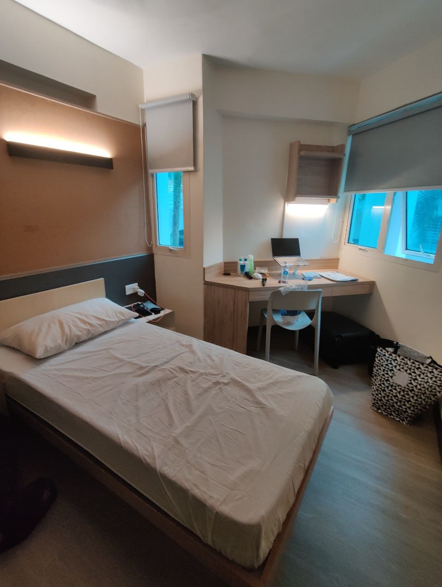

## Applying, Part 5: NIR Ingestion of COVID records

This part is probably not relevant to any future exchangers, but it was supposedly "required" according to the exchange students' guide sent to us by NUS. This involved uploading your COVID vaccination certificates into the National Immunization Registry (NIR) through a verified third-party. There were two methods:
- Using MyDoctorSG
	- This method costs a bit, but it allows you to do this process online.
- Going to a Joint Testing & Vaccination Center (JTVC) in person.
	- This method is free, but requires you to go to specific JTVC points that allow for NIR ingestion.

As it turns out, they needed a certification for every COVID vaccine you had, which means you needed to save every vaccination certificate you have gotten from the EU because the EU only gives a vaccination certificate for the latest dose.

I ended up going to a JTVC point as I thought MyDoctorSG was a bit shady, and it took about 24-48 hours for my records to be properly ingested into the NIR.

That said, I heard from some exchange students that they forgot to do this part entirely but still managed to proceed with the offsite enrollment, which was weird as this was supposed to be a requirement.

## Applying, Part 6: "Registration Part 2"

This part is basically "pick up your student card and activate it."

Before doing this part, I had to pay the Miscellaneous Student Fees (MSF), which came out to 150 SGD.

This part involves:
1. Booking a pickup timeslot via EduRec
2. Going to the pickup location with your passport
3. Showing the people there the email proving that you are picking up your student card and your passport
4. Picking up your student card
5. Activating your student card on EduRec

**Tip:** bring a pair of scissors with you, since you might need to cut stuff.

Also, from what I hear, the timeslot is more of a measure to spread people out across the whole day, so arriving a bit early to pick up your card should be fine too.

## Applying, Part 7 (Last Part): Offsite Enrollment

In the case of some other Singaporean universities, when you want to get your STP, this part would happen at an ICA office. However, NUS has a special agreement with ICA which allows this process to happen on campus.

To do this part, I needed to have physical passport pictures with me that met their requirements. That said, they have a photo studio at the offsite enrollment location too, and most people got their photos taken there as it would be guaranteed that the photos would meet their requirements.

Aside from that, this process works similarly to Registration Part 2, but instead of picking up the student card, I had my biometric data (iris scan + fingerprints) taken. Also, after the process, I had to give a printed copy of my IPA with my Singaporean phone number written on it.

After about a week, my STP was fully activated!

To celebrate finally having covered all aspects of the application process, here's a dependency graph:
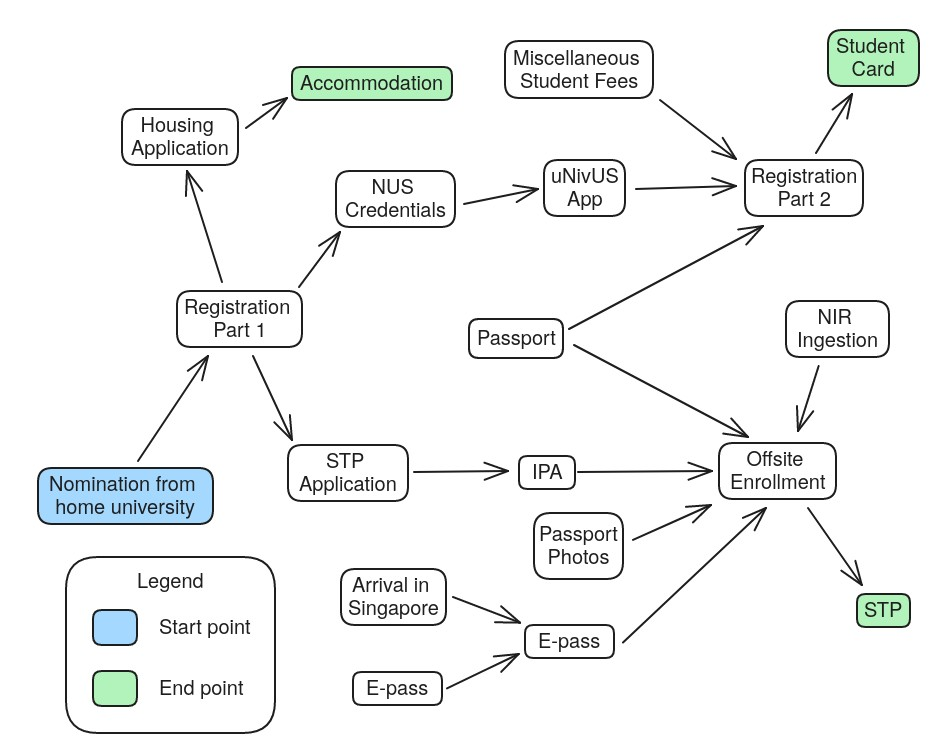

# Academics

With all the settling in out of the way, it's time for the semester to start!

After the course selection process, I ended up with 4 courses:
- CS2100 - Computer Organization (4 credits)
- ME2102 - Engineering Innovation and Modelling (4 credits)
- CS3247 - Game Development (4 credits)
- EE3031 - Innovation & Enterprise I (4 credits)

Here's what an average week looked like (in this case, March 25 to 31):
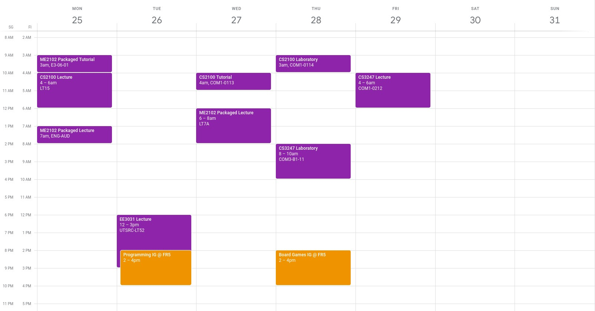

Also, all courses were taught in English.
## CS2100 - Computer Organization (4 units / 6 ECTS)

Course link: https://nusmods.com/courses/CS2100/computer-organisation

I picked this course because it's effectively the deep dive version of one of my favorite courses at Aalto, ELEC-E8001 - Embedded Real-Time Systems (which I'll call ERTS). While ERTS covers how CPUs work from a big picture perspective, CS2100 goes into how CPUs work on a logic gate level.

This course was fairly challenging, but since I enjoyed the material and understanding, it was really fun!

This course's final grade was determined through lab submission points, midterm exam points, and final exam points. The grades were curved.

## ME2102 - Engineering Innovation and Modelling (4 units / 6 ECTS)

Course link: https://nusmods.com/courses/ME2102/engineering-innovation-and-modelling

I picked this course since I wanted to learn how to use CAD properly, as my current understanding is merely from 3D printing. This course was split into two parts:
1. CAD design
2. Stress calculations

The first part had labs where we would go to computer labs and design components (mandatory attendance), while the second part had tutorials where we would solve mechanical stress problems (optional attendance).

The first part turned out pretty fun, learning all sorts of specific design terminology. However, due to my lack of background in mechanical engineering and my lack of interest in physics, the second part was really really hard. It basically involved a whole lot of calculations to figure out if some components could take a load without breaking.

The course was partly easy, partly really challenging. Overall, I think it was pretty well taught (especially for the first lecturer), I just wasn't very into the material by the end of the course.

Also, this course had 1 exam and 1 quiz for the first half, and 3 quizzes for the second half. The grades were curved.
## CS3247 - Game Development (4 units / 6 ECTS)

Course link: https://nusmods.com/courses/CS3247/game-development

I picked this course because I wanted to learn about game development. However, this course used unreal engine and kept forcing us to take into account how to design for VR, which is something I felt was hindering my learning process. Additionally, the final project for this course had technical requirements, and I felt that we focused more on creating a game that fit these requirements rather than making a genuinely good game.

This course had weekly tutorial sessions where we could ask teaching assistants for advice regarding our game, but attendance was optional. Final grade was determined by 5 mini-projects + final project grades that were given by course assistants and/or the professor.

Overall, it wasn't a particularly enjoyable course. The project and mini-projects were also a lot of work.

Also, running Unreal Engine on a laptop with integrated graphics in Singapore without aircon is an excellent way to get your CPU temperature up to 90°C.
## EE3031 - Innovation & Enterprise I (4 units / 6 ECTS)

Course link: https://nusmods.com/courses/TEE3031/innovation-enterprise-i (It seems the code was changed to TEE3031 after I took it.)

To be honest, I picked this course as a filler course.

I actually quite enjoyed this course, in the sense that every lecture was very much like a story, and the professor is definitely quite eloquent. However, I feel like the examples he used to convey points were sometimes a bit outdated. I did understand his points, but sometimes their relevance to the present is questionable. Also, some other examples were exaggerated or oversimplified. This course came off very much like a story.

This course could be considered the product development version of our TU-A1300 - Introduction to Industrial Engineering and Management here at Aalto, but this course also involved more practical parts like pitching, which really helped with improving public speaking skills.

During this course, we had to pitch product ideas, which would then be voted on. Only the top 10 products were to move on to the later stages, where more and more details regarding how the product would go to market were developed. They said the product had to be achievable given current technologies, but given that one group used "vibranium" as a material, I'm guessing that requirement is bogus.

One funny thing that happened is that about a fifth of the students taking this course were exchange students, but the majority of top 10 products were created by exchangers.

Overall, a pretty fun course!

However, I would like to note that the lectures for this course took place on Tuesday evenings from 6 PM to 9 PM. My naive self prioritized academics over events, and I ended up missing out on 5 really big events just because of this course. I think I was just horribly unlucky, as all the big events just all happened to be on Tuesday evenings.

If I could pick courses again, I would definitely avoid evening courses, as lots of student activities happen then.

Assessment for this course was done via many pitches and product reports that we had to make throughout the course.

## Observations

While doing courses at NUS, I noticed a few differences from Finland. For example, it's usually frowned upon to directly refer to a professor by their first name like we do here. Rather, they prefer being called "professor" or "prof." I'm assuming this is due to their standard of respect.

Also, one other thing I noticed was that student in-class participation was usually very low unless there was merit to doing so. I heard from local student that this is usually because most students are afraid of being "wrong." Even if student participation is rewarded, the responses from students tend to be what the professor wants to hear rather than their actual thoughts.

There were a lot of instances (especially in CS2100) where the professor waits a bit after asking a question, waiting for a response, then just saying the answer right after, and I feel pretty bad for the professors when that happens.

## My Experience

Overall, I think the courses at NUS were definitely a lot more challenging than those at Aalto. They're a lot more strictly managed, considering how the courses than did have exams never only had one (CS2100 had midterm + final exam, ME2102 had CAD test, CAD quiz, followed by 3 mechanical-engineering-related tests). Also, attendance was definitely taken more often than here at Aalto.
# Facilities

NUS's campus is absolutely gigantic. Although they may have around 3 times the number of students that Aalto has, they definitely have more than 3 times the number of buildings, so much so that there's an internal campus bus system run by NUS that allows students to hop on and hop off for free as they please.
## Pioneer House

PH was, as I previously mentioned, my accommodation during my exchange in Singapore.

Consisting of blocks 20 to 25 at PGP, it is the closest house to the PGP canteen, and aside from student housing, it also has lots of student spaces such as:
- seminar rooms (basically classrooms)
- lounges (basically a room with couches, tables, and chairs)
- a quiet room (basically a lounge but with the implied rule of being quiet while using the space (although it felt like no one cared about that rule))

All of which were air conditioned. It also has a laundry room in the B1 level for every pair of blocks (20/21, 22/23, 24/25), and there's one shared toilet for every floor of every block. 

Block 24 is the only non-AC block, if I remember correctly.

Also, there's a cool restaurant called JB101 within a 5 minute walk out the back gate, where you can get free flow ice cream (basically as much ice cream as you want) as long as you order a meal after 5 PM. It's only marginally more expensive than the meals at PGP canteen, costing around 5.50-6.50 SGD per meal.

Unfortunately, I don't have any pictures of the accommodation besides those of my room.

## Prince George's Park

PGP is a pretty large area. Here's a picture I took of the entrance:
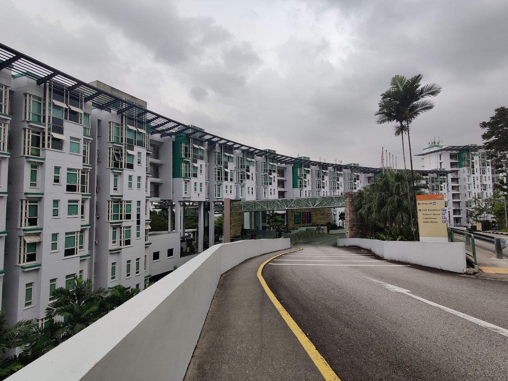

You can see the PGP Foyer campus bus stop in the picture too, where all the little poles are.

All the blocks marked with green accents are part of PGPR. Behind PGPR, the color codes are as follows:
- Yellow - LightHouse (LH)
- Blue - Pioneer House (PH)
- Red - Helix House (HH)

PGP is a really large place. The following things are present:
- Two basketball courts
- A tennis court (?)
- An outdoor gym
	- It's like one of those mini neighborhood outdoor gyms with only machines. Although, nobody uses it because Singapore is hot.
- An indoor gym (AC)
	- Unlike the other on-campus gyms, you just need to show up to the security guard's desk with your student card, which you can exchange for a gym keycard for access.
	- It's open 24/7, but the security guard may be asleep if you try to enter the gym at 4-5 AM (If you're the guard, sorry for waking you up T-T).
- PGP Canteen
	-  It's a food court. More about the options in the food section later.
	- Stalls open around 7:30-8 AM in the morning, and close around 7 PM.
- SuperSnacks
	- A small restaurant that sells craving foods like chicken burgers, waffles, fries, quesadillas, among other things.
	- I don't really know when it opens, but it closes at 1 AM, which is handy for when your lecture ends at 9 PM (looking at you, EE3031).
- Pick & Go
	- This is basically an Amazon Go. You install the app, link your payment card, get your app's QR code scanned at the entrance, pick what you want, and walk out. (I've never seen so many security cameras on one ceiling in my life before)
	- It's more like a convenience store, so it mainly sells snacks and drinks, with some essential consumables like batteries or shampoo also present.
	- The prices of most items are marked up a bit, so I would rather opt for getting stuff from FairPrice instead.
	- It's open 24/7.
## NUS Facilities

Outside of PGP, I mainly frequented:
- buildings of the College of Design and Engineering (CDE)
	- it's arguably the hardest set of buildings to navigate through, unanimously agreed upon by every student I met.
	- the majority of buildings have interconnects to one another, and the interconnects may connect different floors (For example, L7 of EA connects to B2 of E2) and there isn't really a guide on this so you have to figure it out for yourself.
- buildings of the School of Computing (SoC)
	- Pretty nice, although the first level of COM1 really feels like it was built to be a maze.
- Central Library
	- This felt a lot more like a huge study area more than a library. Every floor had tons of desks and chairs (which were very comfy).
	- However, as this place is the go-to study area for most students, it's often very crowded, especially if you come after lunch.

Overall, there were a ton of buildings, and I think spending a day exploring campus could be a really fun experience!

# Daily Life

To be honest, I didn't really take full advantage of my time during my exchange. My time in Singapore was mainly used for the following things:
- Maintenance tasks (personal hygiene upkeep, laundry, etc)
- Social media consumption
- Studying (including lectures, tutorials, labs, etc)
- Eating
- Participating in extracurricular activities

Since the first three things are pretty universal experiences no matter where you are as a student, I'll mainly be focusing on the last two.

(Also, if you're going on exchange, no matter where you're going, please minimize time on social media and actually live life. Spending so much time on it is by far my biggest regret during my exchange semester.)

## Extracurricular Activities

There are all sorts of activities available at NUS, with varying group sizes. They can go from campus-wide activity groups (which are called Co-Curricular Activities, or CCAs for short) to small clubs within each hostel, known as interest groups. Additionally, depending on your accommodation, there may be one-off accommodation-wide events like field trips.

For CCAs, registration is done on a platform called NUSync. As for interest groups, field trips, etc, events are usually announced in Telegram channels with a sign-up link. Or in the case of some interest groups (or IG for short), registration isn't required at all; you can just show up.

In my case, I joined the NUS Hackers CCA (I'm actually not entirely sure if it's a CCA), which had regular talks twice a week about technical computer science topics and offered free bubble tea and pizza to participants. Additionally, I was also part of the programming IG and board games IG in PH, which has weekly sessions.

## Food

Food in Singapore is really cheap. Meals usually cost around 6-8 SGD off-campus and 4-6 SGD on-campus. The food quality is also really really good; I still miss a lot of the things I ate on a daily basis over there...

My main go-tos were:
- PGP Canteen
- Kent Ridge MRT
- JB101
- Clementi Mall

Here are some images of things I ate:

| 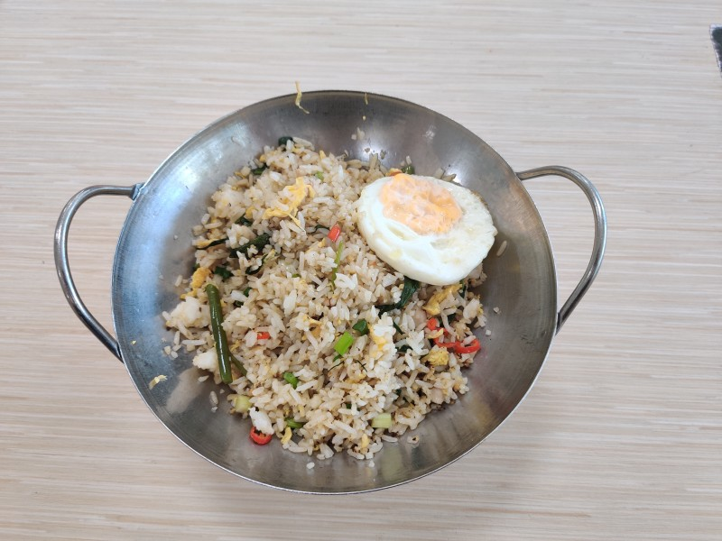 | 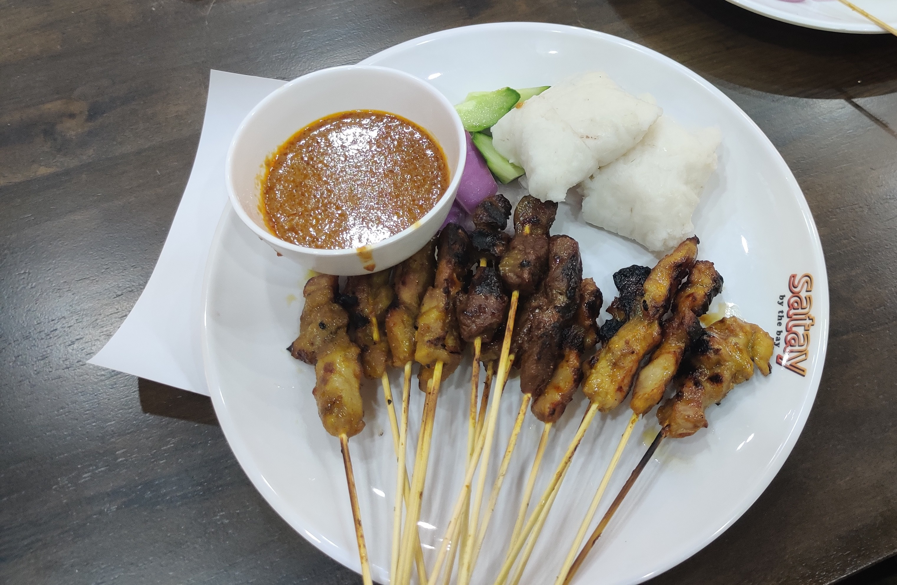 | 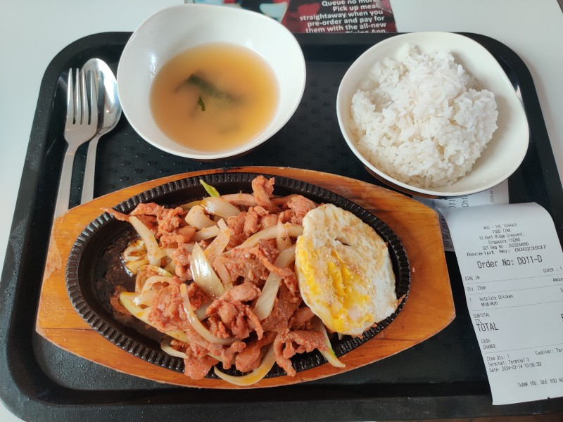 |
| --------------------- | --------------------- | --------------------- |
| 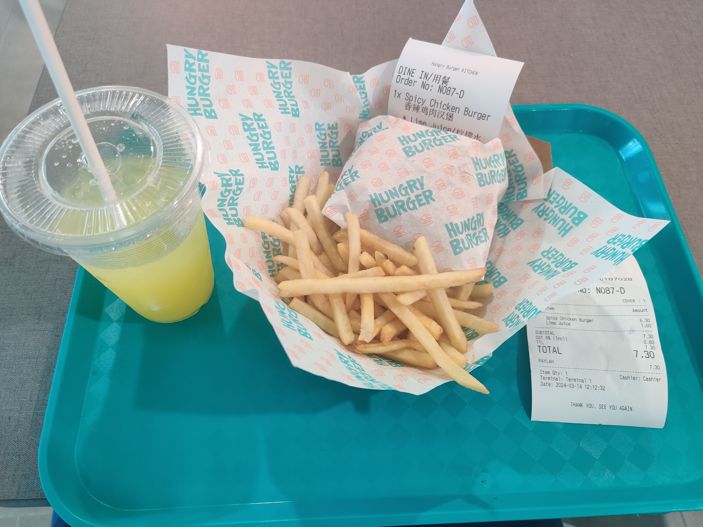 | 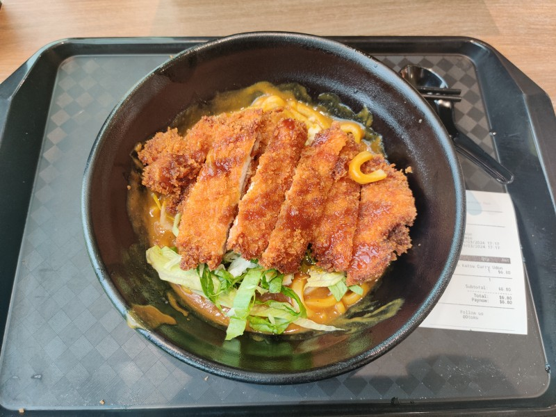 | 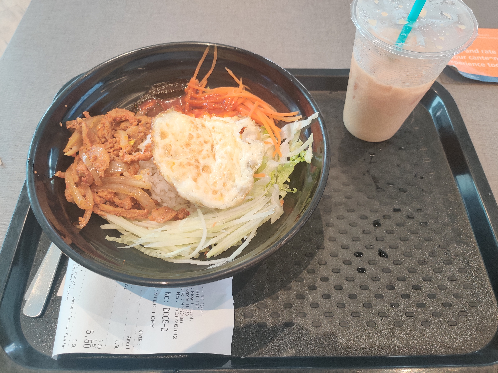 |
| 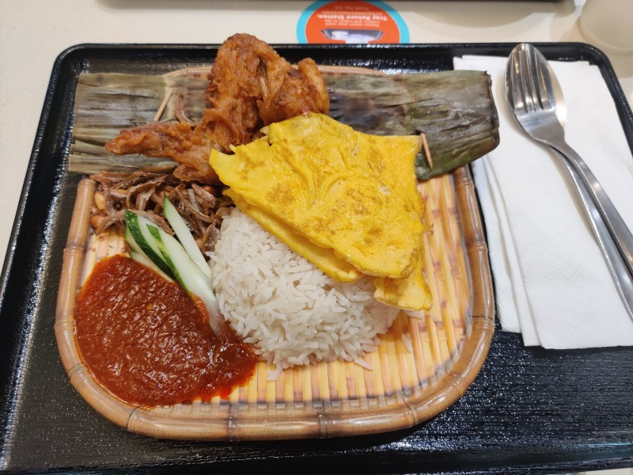 | 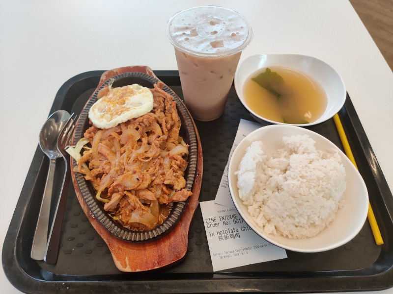 | 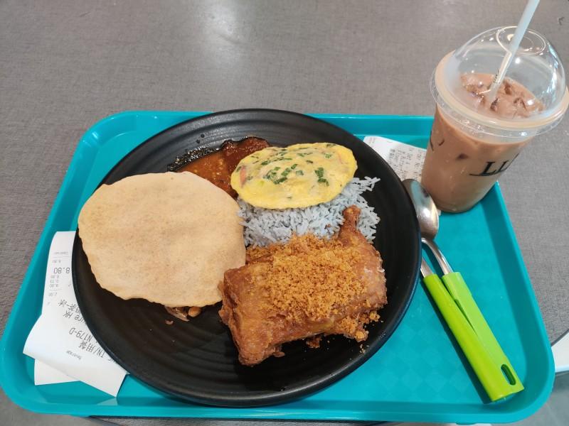 |

Most of the above cost between 4 and 7 SGD.

Oh, also, tap water is drinkable in Singapore, unlike in most other Southeast Asian countries. That said, the coldest tap water is more like room temperature, so I tend to get my water from a water cooler. Water coolers are located all over campus and are free to use. In addition to cold water, the water coolers also have boiling hot water, which makes making cup ramen super convenient.

# Trips

One of the reasons I chose Singapore as my exchange destination was because it was conveniently located near lots of other Asian countries. However, I ended up not using that ability very much. I visited Malaysia several times, both through the Woodlands Checkpoint (land border between Singapore and Malaysia) as well as by air, and I also visited Japan once.

Not everyone will visit Japan, so I'll just give some tips for traveling to Malaysia.

## Malaysia

Traveling to Malaysia can be done in two ways. First, by crossing the land border (Woodlands Checkpoint) North of Singapore. I would recommend going nearer towards the afternoon to avoid the rush of people crossing the border to go to work. Also, make sure you have a debit/credit card that supports Visa, since Malaysian busses used within the border checkpoints lets you use your Visa card as your bus card. I learned this the hard way when I tried to cross the border with my MasterCard credit card and it didn't work.

The second method is to travel by air, which costs about 65-75 euros for a round trip. I used this method a couple times during my exchange, and I would recommend AirAsia over Jetstar (those are generally the two main options for this route) as Jetstar flights on this route were often delayed.

I'd like to note that Johor Bahru (the city you arrive in upon crossing the land border) is quite a bit more expensive than Kuala Lumpur. However, both places are cheap compared to Singapore.

# Wrapping Up

As of mid-May, my exchange semester ended. I'm really grateful to have been given this opportunity to study in Singapore, and I really think it was a once-of-a-lifetime experience, even if I didn't utilize it to the fullest. I met so many new people there from all over the world.

## Takeaways

This exchange was actually my first time living alone, so I ended up learning a lot about myself from that experience alone. That said, I feel like living on your own in NUS is like living alone lite edition. You have all the food choices you could want at a low price and are available throughout the day which means you basically never have to cook for yourself, bathrooms and hallways are cleaned on a daily basis for you, and you're in the middle of Singapore, meaning travel times are never excessive.

As a person who's been living in Finland for a really long time, I feel like one special takeaway I've had through this exchange experience is related to **people**. Compared to Finland, which sometimes feels like a ghost town the moment you step outside the city center, in Singapore, you basically cannot avoid seeing another person no matter where you are (unless it's like 4 AM). Although it sometimes does feel like you have little privacy or personal space, I think it really helped me realize the importance of social health. With the super high population density coupled with the frequent event announcements, it really doesn't get any easier to get to know new people and form new friendships.

I don't mean that it's impossible to form friendships in Finland, but the fact is that student life in Singapore offers far more opportunities to create and maintain friendships.

# Extras

## Non-AC Life

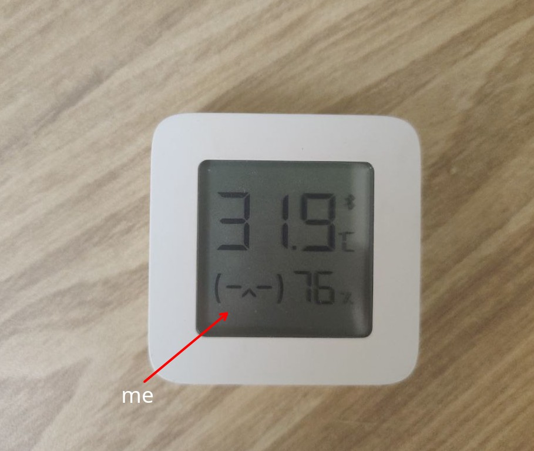

I brought a little thermometer with me as a sanity checker. The temperature in my room ranged from 29.5°C to 32°C during my stay, with the humidity ranging from 75% to 90% (on rainy days).

TL;DR: Only get a non-AC room if you have actually lived in such conditions before. If not, I would heavily discourage it.

Not having an AC was pretty tough, since the heat wasn't at a level I could just ignore. The main issue with this is its interference with sleep. Here's roughly my method of managing to sleep:
1. Take a cold shower (even though the cold water isn't really cold)
2. Immediately head to bed and do not get off the bed.
3. Do not toss and turn excessively.
4. If you're unable to sleep after ~15min, head to the nearest lounge, don't turn on the lights, and make the AC cold.
5. After ~15min, head back to the room and try to sleep again.
6. Repeat as needed.

Safe to say, there were a lot of 3 AM nights, and I roughly slept 6 hours on average during my exchange.

The humidity was the main obstacle, as after a while, your skin will get sticky, making it really hard to get anything done. However, I can safely say that after about 3 months passed, my body eventually acclimated and 29°C started to feel cold in the weeks leading up to my departure. Coming back to Finland with this "heat resistance buff" was also rough since it was 7°C on arrival but it felt more like -2°C. It does wear off after a month or so, though.