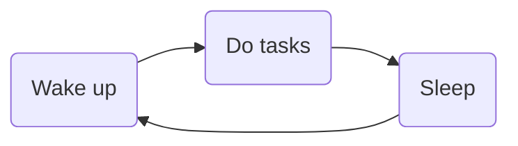

+++
title = "[1] Introduction"
date = 2023-07-24T12:59:53+03:00
draft = false
mermaid = true
+++

## Origin

**TL;DR: Project TTMS is only part of the solution to self-organization.**

While I was pondering about Project TTMS, I realized that the whole point of an organizational system is to make the process of planning and organizing tasks as seamless as possible, such that I can maximize the amount of effective time (time spent **actually doing** the tasks). No matter how seamless my self-organizational system is, it doesn't matter if I cannot actually execute my tasks efficiently.

In essence, the goal for both self-benchmarking and Project TTMS is to **get as many things done as possible**.

So, how do I get more things done?

## Why Benchmark?

My first thought was simply tackling this as if I were an algorithm (the software kind). To optimize an algorithm, one usually does the following steps:
1. Design the algorithm
2. Test the algorithm
3. Benchmark the algorithm
4. Optimize the algorithm
5. Repeat steps 2-4 until the desired outcome is achieved

Now, let's adapt the steps above if we think about the algorithm being me executing tasks.
1. Make me exist (DONE, you're reading something I wrote, after all.)
2. Test myself (DONE, because I'm capable of doing tasks.)
3. Benchmark myself
4. Optimize how I complete tasks
5. Repeat 3-4 until the desired outcome is achieved

To summarize, the entire point of this thoughtbook is going to be about what I do to perform steps 3 and 4, but since benchmarking will take the bulk of the time, most of the posts will be focused on that.

### Setting Limits

When it comes to benchmarking, I also need to set some ground rules/limits. I could hypothetically aim for the following:

but I can already tell that is neither realistic (I'm not going to be benchmarking myself forever...) nor is it sustainable, as it leaves me super prone to burnout.

I eventually settled on the following:
- I can only start benchmarking after completing my morning routines.
- I can benchmark myself for 10 hours a day at most.
- The benchmark can be stopped as long as it has taken place for at least 5 continuous hours.
- Only one benchmark session can take place per day.

## The Prerequisites of Benchmarking

In my opinion, any benchmark needs to have two prerequisites:
- It needs to involve a metric that's measurable.
- It needs to be repeatable.

### Measurability

The reason why a benchmark is useful for optimization (in general) is because it lets us figure out if a change positively impacted whatever we are optimizing.

### Repeatability

Unfortunately (or fortunately, depending on how you think about it), humans aren't exactly computers. We are much more unpredictable than computers, and there's even a whole field called psychology for attempting to predict our unpredictable nature.

If we want to benchmark something, it's very important that the benchmark is **repeatable**. If the results are all over the place, their significance is essentially useless. 
