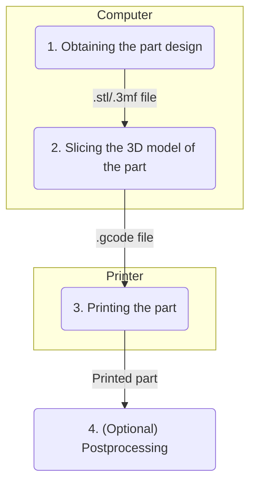

+++
title = "[Module 1] The Basics"
date = 2023-08-17T15:04:41+03:00
draft = false
mermaid = true
+++

**NOTE: This bundle will be focusing on FDM/FFF (Fused Deposition Modelling/Fused Filament Fabrication) 3D printing. In layman terms, the type of 3D printing where plastic filament is involved.**
# Prerequisites

To follow this section, I suggest having the following:
- A functional 3D printer
- PLA filament
- A computer

# Objective

After reading this article, you should be able to:
- Find 3D models from online sources
- Use a slicer to turn a 3D model into gcode
- Successfully print a model
- Understand the general 3D printing process

TL;DR: You should have the bare minimum of understanding needed to print a 3D model.

# The Process

The 3D printing process roughly has the following steps:

## 1 - Obtaining the part design

There are two options when it comes to this: 
- Download a design from an online 3D model sharing site such as [Printables](https://www.printables.com/) or [Thingiverse](https://www.thingiverse.com/). Printables is the newer site, but Thingiverse has a larger collection. When using such sites to get a model, **please comply with the design license restrictions.** 
- Design the part yourself. For 3D printing, parametric CAD software such as [Fusion360](https://www.autodesk.com/products/fusion-360/overview?term=1-YEAR&tab=subscription) and [Onshape](https://www.onshape.com/en/) are often used. However, 3D mesh modelling software such as [Blender](https://www.blender.org/) may be used as well. 

### (Optional) Parametric CAD vs Mesh Modelling

Parametric CAD programs use sketches, dimensions, and constraints to represent a 3D model, while mesh modelling software use vertices and faces to represent a 3D model. In practice, this means that designs done in parametric CAD tend to me more dimensionally accurate, while mesh modelling allows for more artistic freedom.

That said, parametric CAD software tend to require paid or educational licenses and are closed-source, while Blender is professional-grade, free, and open-source. There *are* open-source parametric CAD software out there, but they are far behind the paid options (in my opinion).

If you aren't part of an educational institution or have no means to get a professional license for parametric CAD software such as Fusion360, I would recommend Onshape as they intend to keep a free tier forever. Note that anything you design on the free tier of Onshape are publicly accessible by anyone.

### File Formats

In the past, the standard for 3D design files for 3D printing was the .stl file format, but in recent years, better formats such as .3mf have gained popularity. If you are to design your own parts, I would recommend exporting in the .3mf file format.

If you want to investigate the differences between .stl and .3mf files in more detail, check out [this article](https://www.3dnatives.com/en/stl-vs-3mf-280620224/).

In a nutshell, compared to .stl files, .3mf files are:
- more compressed (smaller file sizes)
- may contain material or color information
- may contain printing options
- specifically designed for use in 3D printing.

## 2 - Slicing

Our 3D design files contain information about the form of the 3D part we want to print, but unfortunately, 3D printers are dumb. 3D printers only understand machine instructions, which are more or less:

> "Move the X motor by 30 steps"
> "Move the Z motor by 2 steps"
> "Move the E motor by 7 steps while moving the Y motor by -31 steps"

But how do we go from the dimensions of the part to instructions for the machine to print our part? This is where the **slicer** comes in.

A slicer is essentially a piece of software that takes in parameters about how you want a part printed (how fast the machine should move, what material is being used), and turns it into machine instructions (.gcode files). It's called a "slicer" because it turns solid model objects into instructions for the printer to create the model out of 2D "slices" (layers) of material.

The most common slicers used these days are [Cura](https://ultimaker.com/software/ultimaker-cura/) and [PrusaSlicer](https://www.prusa3d.com/page/prusaslicer_424/), both of which are completely free and open-source. For beginners, I recommend Cura a little more, but if you want full control over the slicing process, I prefer PrusaSlicer. Both are fairly beginner-friendly if you ignore all the additional/expert parameters.

### A little note about all the parameters

As long as your printer isn't super obscure and has a decent userbase, chances are that these two slicer software already have default settings made for your printer, which you can select in the setup process. For some models, these default settings should work, but due to the limitations of 3D printing, many models will fail to print. We'll cover the limitations of 3D printing in more detail later.

### Note about Ultimaker printers

If you are using an Ultimaker printer, I **highly** suggest you use Cura, as it was designed by Ultimaker to be used with their printers, and other slicers may not work seamlessly with the printer (some machines don't seem to use .gcode files).

## 3 - Printing the part

Well, this stage is pretty self-explanatory. Most printers have a slot for an SD-card, microSD-card, or USB stick. After slicing, you should transfer the .gcode file to your SD-card/USB stick and put it back into the printer. You should then be able to select your file for printing through the printer's menu.

Some newer printers support file transfer over WiFi, thus making the process completely wireless. I would like to note that this might not be a great option if your printer is located to a large network, as it might be hard to locate your printer in the network.

## 4 - (Optional) Postprocessing

### Removing extra structures

When you were slicing your 3D model, you may have gone to the preview tab and discovered that the slicer added some additional structures in addition to the model you want to print (We'll discuss why they exist later). After printing the model, you might have to remove these additional structures to obtain the part you're looking for.

Common tools for the job are:
- Cutters
- Pliers
- Precision knife or box knife

With a little brute force, you might be able to pry these unwanted structures away from your model.

### Removing layer lines

**Note that by doing postprocessing to remove the layer lines, you may change the dimensional accuracy or physical properties in the process. I would only recommend doing this if you care about the aesthetics of your part above all else.**

Layer lines are inevitably visible with FFF 3D printing. They are created because the process relies on stacking layers of material on top of one another, so it's inevitable that the layers are going to be visible from the side of the print.

If you find the layer lines on the part undesirable, there are several methods to remove them, but in this guide, we will focus on the sanding/wet-sanding + filler primer method as it doesn't require a lot of extra equipment and is fairly low-cost.

The advantage of using wet-sanding over normal sanding is that the part will not heat up so much due to the presence of water, therefore your part is unlikely to deform due to heat from friction. However, it does also cause the process to be a little more messy.

The method is as follows:
1. Start with a low grit of sandpaper, somewhere around 200 grit.
2. Sand the part
3. Apply a coat of primer on the part (optional)
4. Increase the grit of the sandpaper by 50-200 grit
5. Repeat steps 2-4 until satisfied.

Stopping at around 1000 grit will leave a rather matte finish, while going up to 4000 grit will start to make the part glossy purely from sanding. However, going to higher grits will take a considerable amount of time and effort.

To finish the part off, using a final coat of spray paint should hide any remaining imperfections.

# Limitations

Unfortunately, 3D printing isn't a silver bullet for manufacturing. There are two main limitations:
- 3D printers are not able to print suspended pieces of plastic in midair because gravity exists.
- Because of thermal expansion and contraction, the layers of plastic actually contract slightly as they are printed on top of one another. This has several consequences, with the worst one being that the print fully detaching from the print bed, leading to a mess of a failed print (this is also known as "printing spaghetti").
