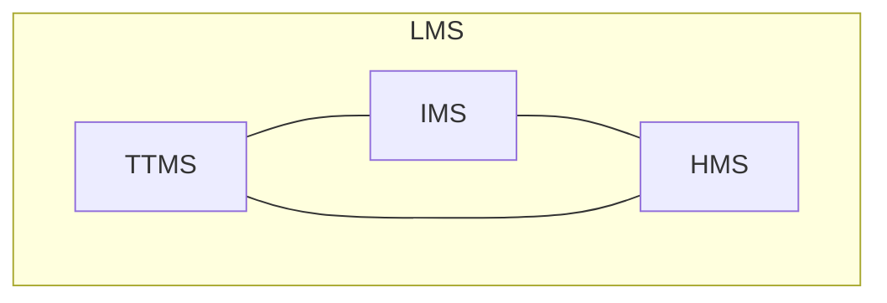

+++
title = "[Part 1] Origin"
date = 2023-09-25T14:21:51+03:00
draft = false
+++
# Background

I have rather terrible self-organizational skills. For the last 4-5 years, I've essentially been just winging it. To meet the deadlines and requirements given to me by life, I've been using solely a calendar (for tracking very important events) and sheer will. In a nutshell, I've just been controlled by the demands of life. Tasks are usually only done when the deadline is looming over me, and I have almost no hobbies. I do however manage to rapidly complete projects if a sudden wave of motivation hits me, but if hardships hit or it takes longer than expected, the project gets abandoned. And yes, having a heavy procrastination problem is a given.

However, there's a problem (if it wasn't glaringly obvious already). I'm already in my 3rd year of university, and I probably should get my life together.

# Brainstorming

To start, I began asking myself the question: "How does one get organized?", which leads to "What needs to be organized?".

## Organize what?

First, the obvious one: the baseline requirement of daily life is to be able to **keep track of important appointments, tasks/assignments, and deadlines**. For any individual, this is a fundamental need as there are usually direct consequences to not showing up on time to an important event or not completing something important in time.

The second thing that needs organization is **knowledge**. In modern times, I believe that it's almost a necessity to keep gaining more knowledge. Knowledge, and in turn, skills, are very important for the constantly-evolving world where being left behind might lead to life instability.

The third thing that, in my opinion, needs to be managed, is habits. In life, some things aren't under our control, and sometimes those things actually affect us. When it comes to things that have a mental effect on us, I think it's very important to ground ourselves mentally such that we can take care of ourselves despite the happenings of life. However, needing to intentionally pay attention to everything we need to do to take care of ourselves is very mentally demanding. Luckily, we humans have a nice built-in function: habits. By offloading these self-care tasks to our subconscious, it lets us save our mental energy for more cognitively demanding tasks in life that don't happen every day.

Having to manage habits might seem excessive, but I think it's very important in modern days also because of social media and similar digital applications that are designed to steal your attention away. They reinforce bad habits (like checking your social media right after dismissing your alarm) without us even noticing. Therefore, I believe a habit management system to **intentionally** build on good habits and break bad habits is very important.

# Back to this project

This project aims to help manage the three things mentioned above. If those things are managed, life is managed. Therefore, this project is called the Life Management System (LMS).

Similarly, the three sub-components are called:
- Time/Task Management System (TTMS)
- Information Management System (IMS)
- Habit Management System (HMS)

(I would've liked to call IMS the "Knowledge Management System," but having the abbreviation be "KMS" doesn't really sit well with me...)

Each sub-component will be its own project, and more details about how each thing is managed will be explained much more thoroughly in their corresponding projects.

## Core Requirements

Although LMS may be considered solely the sum of its three sub-components, I want the whole system to have a heavy emphasis on convenience. After all, I don't want rely on or use something that is inconvenient. Therefore, all components in this system need to be digital.

Extending on that thought, the system should also be usable on several devices, and the data should be synced across all devices. This is because most people already have multiple devices, and it would be most convenient if the system (especially the TTMS and IMS) can be accessed from any one of them. 

Additionally, as most people have a computer and a phone, the roles of the devices should be slightly different. A computer allows for more comfortable input, while the mobile device's small screen restricts what can be done on it. Therefore, the computer interface should prioritize making data input as comfortable as possible, while the mobile interface should prioritize data referencing (e.g., checking events is prioritized over adding events).

Furthermore, as this system will be dealing with quite a bit of important data, it is very important that the data remains fully under the user's control.

Finally, as convenience is important not only for daily usage but also the setup process, setting up the system should be simple and straightforward.

TL;DR, The system should:
- be digital.
- support multiple devices and syncing.
- allow the user to remain in full control of their data.
- be easy to set up.
