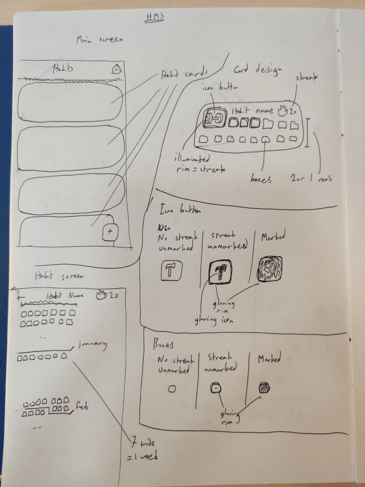
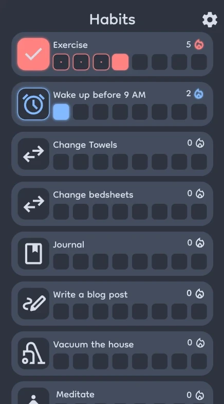

+++
title = "[2] Initial UI Planning"
date = 2024-01-26T21:03:16+08:00
draft = false
+++

Warning: I am not a UI/UX designer. I haven't learnt anything formally, so my method of designing interfaces is essentially:
1. Make sure I can figure out how to use it fairly intuitively
2. Make it not look like an eyesore

# Design 0.1: Paper Sketch

As I am not very familiar with design software, I decided to go with my most comfortable design medium: pen and paper.

Here's my initial design. (Pardon the illegible handwriting)

I hope that got the message across.

# Design 0.5: Penpot

With my newly-made paper sketch, I decided to make my design digital and less painful to look at. To do this, I started looking into software that professionals usually use to design mockups. Figma seemed to be the most popular choice, but I wanted to try out an open-source alternative, which led me to [Penpot](https://penpot.app). It's fairly intuitive to use, and I managed to whip up this little home screen without too much effort. I wanted to try out a rounded look, so I used the [Dongle font](https://fonts.google.com/specimen/Dongle) which I found on Google Fonts. Since I hate coming up with new color schemes, I just repurposed my blog's color scheme for this, and I think it looks okay.

Of course, you can tell that I'm a newbie to this kind of software. Just take a ruler, put it on your screen, and you'll probably spot at least 9 things that aren't aligned.

## Next

The design is definitely not satisfactory to me. I don't really know how to round corners well to make sure things look right, which is why the right side of the habit cards look pretty awful. Additionally, I feel like I shouldn't use my blog's color scheme. I think something more color neutral would be better, as that would allow the user to have a better selection of habit accent colors without the accent color looking weird (for example, a yellow habit with my color scheme would look awful).

I also have yet to design the individual habit pages, which I sort of want to look like the GitHub commit heatmap, except tipped on its side to make it vertically scrolling. I'll give designing another shot when I've looked into proper UI/UX design a little more!