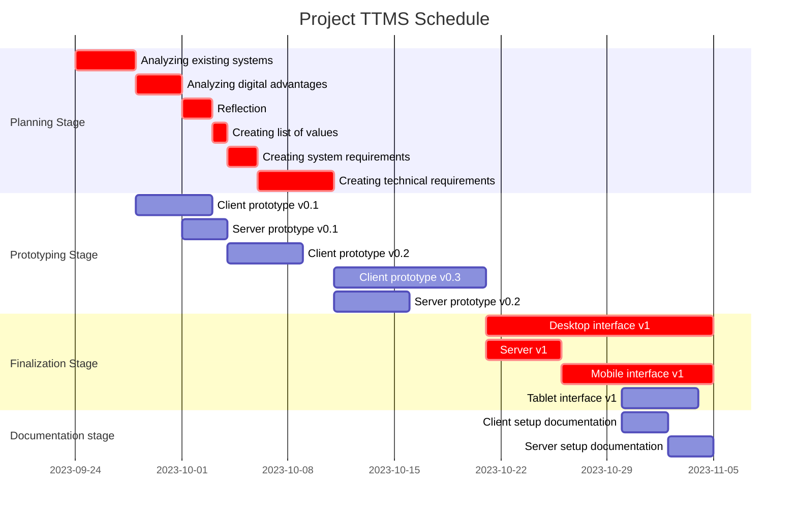

+++
title = "[Part 1] Core Concepts & Evaluations"
date = 2023-010-7T13:49:38+03:00
draft = false
mermaid = true
+++
# Core Concepts

Before starting with this project, I want to cover some core concepts I want. Namely:
- Ease of use
	- All commonly-performed things (e.g., adding a task, scheduling a task) should be the easiest things to do in the app.
	- Reducing usage difficulty is key to making me stick to using it.
- Out of sight, out of mind.
	- I tend to get easily distracted by what I should be doing due to excess information. Thus, for dashboards or similar screens where I only need to be aware of what I need to do next, all events that I can do nothing about should be hidden away or made less prominent.
	- The inverse is true. For example, on a task management screen, I want all the tasks I am able to complete right now to be visible so that I am aware of their existence.
- Multilevel Prioritization
	- I like to have at least two levels of priority. An example of this "multilevel" prioritization is having two categories, personal projects and schoolwork. Obviously, schoolwork is prioritized over personal projects. Within the schoolwork category, there could be my assignments which are prioritized by deadline or difficulty (or both), while within the personal projects category, there could be "IoT alarm clock" and "Desk lamp, " which are prioritized as I see fit.
	- I feel like this is necessary because I have many categories of tasks in my life, and having to prioritize all tasks in one prioritization level makes things messy.
- Creation + Scheduling separation
	- For me, I notice that I tend to have two modes when it comes to creating tasks: idea mode and scheduling mode. In idea mode, I come up with tons of discrete tasks, while in scheduling mode, I figure out when I want to execute those tasks. I think it is important to keep these two separate, as when I come up with tasks, I'm often in situations where I don't want to dwell on the idea for too long (commuting, in the middle of another task, etc). Therefore, if I have to schedule it, I might do it hastily, or worse, I would skip marking the idea down altogether as it is too much of a hassle.
- Subtasks
	- I feel like it's important to have subtasks because one major way to reduce the friction when starting a task is to break a task down into smaller pieces. However, if I simply turn all subtasks into full tasks, it makes the system very cluttered.

# Evaluation

Using the core concepts discussed earlier, I will now walk through some existing systems I have attempted to use. This is going to be how I'll isolate some good ideas from things I have already used.

## Primitive Systems

These are very general concepts that have many different implementations. They can be implemented digitally or with pen and paper.

### To-Do Lists

Pros:
- Super easy to set up (both digitally and with pen and paper)
- Easy subtasks with indentation
- Good separation between creating and assigning tasks
	- No need to assign a time to the task on creation

Cons:
- Primarily one level of prioritization (higher up on the list = higher priority)
	- The only way to achieve quasi-multilevel priority is to have multiple to-do lists. However, this affects the "out of sight, out of mind" concept.
- Scheduling is not so easy and unintuitive.
	- When marking down a date and time along with the task, I have to mentally compare the deadline with the other tasks in the list and sort them chronologically mentally. Additionally, when done digitally, it takes quite a few clicks to set the date and time.

### Kanban Boards

Pros:
- My favorite visuals-wise.
- Multilevel priority is possible 
	- different columns = different upper priority
	- how high the card is = higher priority within the column
- Good separation between creating and assigning tasks for the same reason as for to-do lists.

Cons:
- Subtasks are not easy because you can't really nest cards.
- Scheduling is not easy or intuitive, for the same reasons as the to-do list.

### Calendar

Pros:
- Task scheduling is very easy to do and to reference because I don't need to mentally process any dates and times, just look at the calendar.

Cons:
- No prioritization besides chronological ordering.
- No separation between creating and scheduling tasks (time and date is required on task creation)
- No subtasks
- Either restricted view or overwhelming view
	- If viewing the whole month, there might be too much information, but viewing the week means you might be blindsided by a huge assignment due in the beginning of the next week.

## Higher-level Systems

These are systems that are more like a complete service, developed by a company rather than being a concept.

### Notion

This is a bit more tricky to create pros and cons for because of the sheer flexibility of the system. If it isn't doing what you want it to do, there is always something you can do to improve it.

Pros:
- Immense flexibility, allows for the use of multiple primitive systems and tasks can be dragged across them.
- Very easy to use.
- Cloud synced

Cons:
- Long setup
	- It's easy to have a general system put together, but fine-tuning it to fit my exact needs takes a lot of time.
- Blocks are not very integrated together.
	- I can set views for the same database, but dragging cards between primitive systems only moves the task, and I cannot implement more complex behavior.
- Some fairly basic features are not to my taste, for example, recurring tasks aren't very simple to set up.
- I personally don't like how my data is not completely under my control.

# Stolen Concepts

From the previously evaluated concepts, I have grasped a few ideas.
- I believe that the kanban board can be used to essentially perform all the tasks of a to-do list and do them better. I also like how the kanban board better utilizes the 2D space of a screen, while to-do lists waste a good part of the right side of the screen.
- I think that the calendar is essentially the gold standard in terms of scheduling. There is no beating a calendar view when it comes to figuring out how things are scheduled at a glance.
- I really like Notion's interoperability between its primitive systems. Being able to drag and drop a task from a kanban into a calendar is a workflow I quite like.

From this, I am more or less certain that the main TTMS interface will revolve around a hybrid interface consisting of a kanban board and a calendar, where tasks on the board are displayed both on the kanban board and the calendar.
# Old Schedule

Due to poor time management, the above was not met at all.
