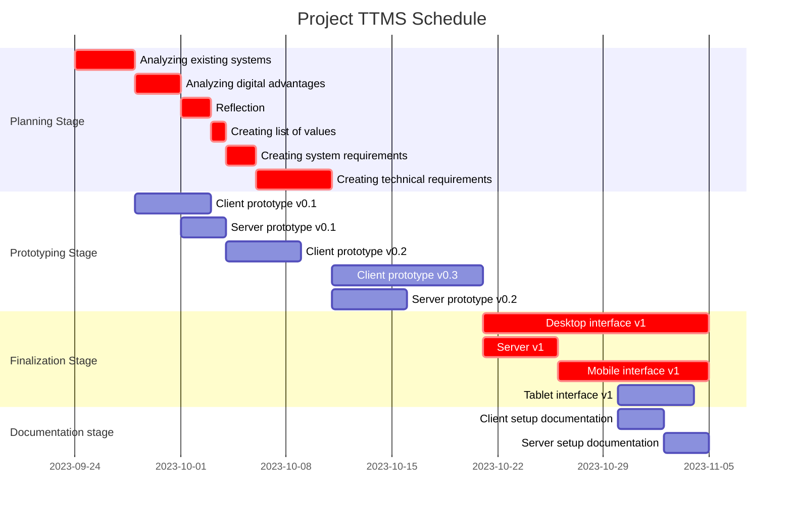

# 

```mermaid
gantt
    dateFormat  YYYY-MM-DD
    title       Project TTMS Schedule
    todayMarker off

    section Planning Stage
    Analyzing existing systems          :crit, 2023-09-24, 4d
    Analyzing digital advantages        :crit, 3d
    Reflection                          :crit, 2d
    Creating list of values             :crit, 1d
    Creating system requirements        :crit, 2d
    Creating technical requirements     :crit, 5d

    section Prototyping Stage
    Client prototype v0.1               :2023-09-28, 5d
    Server prototype v0.1               :2023-10-01, 3d
    Client prototype v0.2               :5d
    Client prototype v0.3               :2023-10-11, 10d
    Server prototype v0.2               :2023-10-11, 5d

    section Finalization Stage
    Desktop interface v1                :crit, 2023-10-21, 15d
    Server v1                           :crit, 2023-10-21, 5d
    Mobile interface v1                 :crit, 2023-10-26, 10d
    Tablet interface v1                 :2023-10-30, 5d


    section Documentation stage
    Client setup documentation          :2023-10-30, 3d
    Server setup documentation          :2023-11-02, 3d
```
