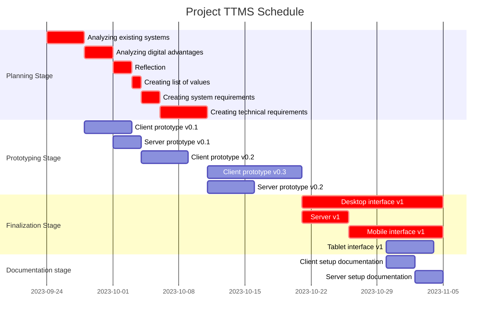

## Introduction

I have terrible self-organizational skills. I've been using a combination of a calendar for marking important events along with scrap pieces of paper which I use as to-do lists for when the deadline for some tasks are within 48 hours.

I want to overhaul my entire system to create something with only me in mind. To do this, I'll start with my least favorite but involuntary pastime: *overthinking*.

(Disclaimer: I might end up rambling quite a bit as my thoughts tend to be unstructured, but I tried my best to add some structure to it to hopefully improve the reading experience.)

## What is Self-organization?

On the conceptual level, I believe that self-organization is about having systems in place to organize one's wants, needs, and responsibilities in daily life such that they are achievable. Being organized in this sense means that one is aware of the things they need or want to achieve and framing them in an actionable manner.

Having "wants" on the same level as needs and responsibilities might seem a little irresponsible, but I think it's important to value them. If we solely lived life according to our needs and responsibilities, we would have very little actual control over the big picture of our lives.

### A more concrete view

Since wants, needs, and responsibilities are roughly on the same level of importance, I think it's a good idea to break them down into more homogeneous terms. The best way I can come up with right now is "goals" and "tasks". Goals allow us to keep the big picture in mind:

> "Have a close relationship with family members"
> "Own a house"
> "Have a position in society where I can have maximum impact doing what I like"

while tasks keep us aware of the things we need to actually do to make our way towards our goals.

> "Organize game nights on Sundays"
> "Apply for a job interview"
> "Figure out what I enjoy doing"

### Goals vs Tasks

To compare the two, I think it's important to see how varied tasks can be.

Tasks consist of two components: the action and the time frame. If you think about it, to do a task, you need to know what the task is, as well as when to do the task. However, these two components are actually slightly dependent on each other.

First, let's look at the action. Tasks can have actions of varying difficulty, and difficult tasks can be broken down into easy tasks.

> "Own a house" -> "Make money" -> "Get a job" -> "Apply for an interview"
> (Disclaimer: this is a gross simplification)

We can immediately see that goals are essentially tasks with very difficult action components.

Now, what relationship does the difficulty of the action on the time frame of the task? By time frame, I mean when the task should be done. For difficult actions, it tends to be unreasonable to set a concrete time frame for achievement, while for tiny tasks such as "put passport in backpack" might take so little time that assigning a time frame to it would take longer than completing the task itself. From this, we can determine that marking a time frame is most important only if it falls around the middle of this spectrum.

#### Extra section: why even record tiny tasks?

I've seen lots of people using the "if it takes less than 5 minutes, do it now" rule. However, I feel like there are exceptions.

For a utilitarian example, let's take *packing luggage* as an example. Firstly, it usually takes time to think of and pack each individual item. If you pack last minute, you might forget things, while if you pack early, you might end up taking stuff out again.

Also, I would like to point out the psychological impact of completing a task. For some people (like me), completing a task also serves as a motivator to tackle the next one. One such scenario I came across was in high school, where I had a lot of math homework to clean up. One time, we were assigned around 25 exercises to complete, with each one taking maybe 3-4 minutes. In this case, the extra motivational boost from ticking off an exercise provided me with the push to complete everything in one sitting.

### Good self-organization?

**I believe that as long as the system allows one to fulfill their wants, needs, and responsibilities, it is considered "good".** Having a complicated system to manage a simple life is wasteful, while solely using a to-do list to manage a CEO's life would be sorely inadequate.

## Closing thoughts

From the thoughts above, I think that the core of a self-organization system is a task management system. However, we've only discussed things on a conceptual level, so the next part is going to focus on assessing implementations of task management systems.

