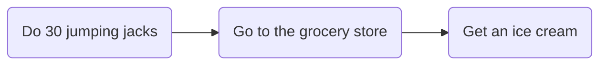
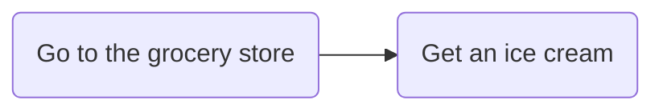

## The Three Types of Task Control

After pondering about the topic for a long time, I took some inspiration from a business-related course I previously attended. **Push and pull systems** in particular stood out to me because I felt like push and pull systems could be abstraction terms used to describe certain task management systems. 

---

(REWRITE IN PROGRESS)

In modern society, we're largely deadline-driven, as it is the easiest method for something to get done. If the consequences of not meeting the deadline are severe enough, there is a much lesser need for self-discipline or motivation.

One thing I find really relevant to the effectiveness of deadlines is Parkinson's Law:

> Work expands to fill the time allocated to it.

This rings true for basically all my deadline-based tasks I need to complete, as I have a horrible tendency to only get started only hours or days before a deadline.

But what about tasks that don't have deadlines? Do I simply set deadlines for myself?

## Deadlines

Before I venture further, I want to explain how deadlines work for me. I'm very honest towards myself, which means that self-rewarding or self-punishing rarely works. Rewarding/punishing only works for me if the following conditions are met:
- It is external (e.g. the reward itself is out of my control).
- I deem that the consequence/reward is worth the difficulty of the task.

For some concrete examples, the following works:
- Getting enough points in an assignment such as to not fail a course.
	- The punishment here is having to study things again to prepare for a retake, or having to do the course all over again. (Consequence is worth the task difficulty: it's easier to complete the course properly than study everything again for the retake.)

while the following does not work:
- Put in the extra work to complete a course with 100% of the points to get a free rubber ducky.
	- Is the rubber ducky worth all the extra time? If I really wanted one, I would simply pay for one.

From the examples above, I hope you can tell why the second condition exists. However, that leaves the first condition. I hinted at its reason in the second example above, which is that **if there is an alternate easier path to the reward, I would take that instead.** For example, if my goal is to have an ice cream, why would I do this:

when I can do this?

The path to the reward or away from the consequence must be a reasonably efficient route.

In summary, to me, a deadline is:
- A point in time when a particular task is due.
- If not completed within the allocated time span, consequences **will** follow.
- The consequences must matter to me, and they must be real and external.

Why wasn't rewarding in that summary? It's because deadlines are fundamentally consequence-based, as having a reward at the end would simply mean that the consequence is being deprived of the reward.

### Self-set deadlines

From the previous section, you can probably already tell why self-set deadlines are very difficult for me. If I want to set an artificial consequence or reward for the completion of a task, the consequence/reward would already be in my control, and adding a task to the process only makes the route to the reward less efficient.

## No deadlines?

At first glance, this approach might seem super stupid. If I don't set a deadline, wouldn't Parkinson's Law effectively cause me to abandon my tasks indefinitely? The answer is yes and no. Yes, in the sense that I have abandoned projects before due to having no deadlines, but also no in the sense that some projects I have executed in the past have been completed at full speed.